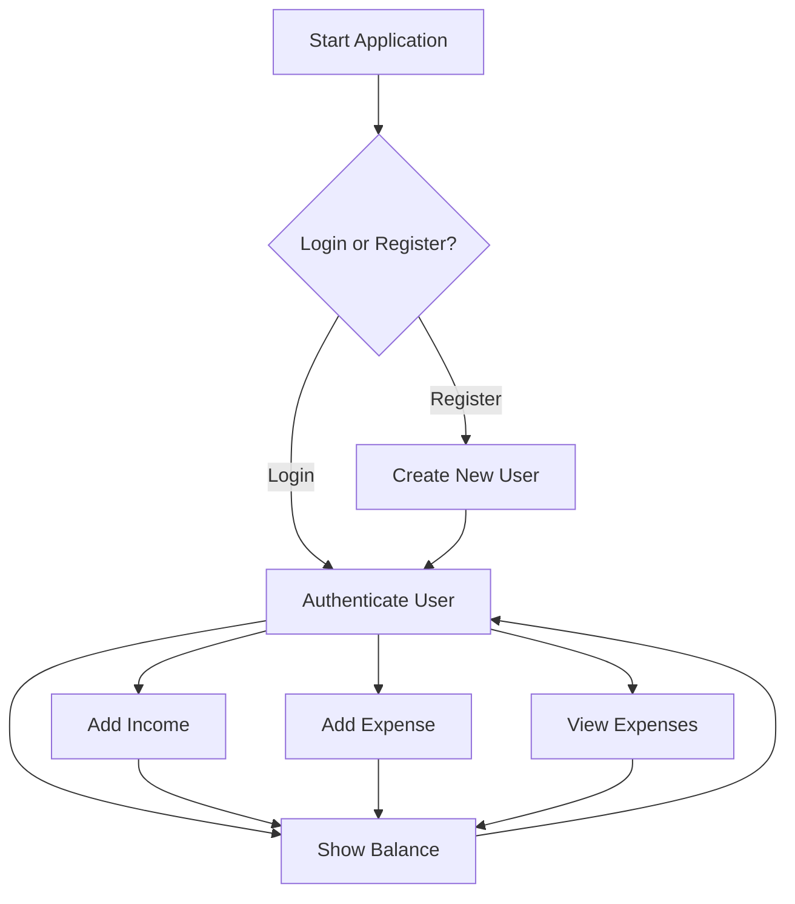

# ExpenseTracker

A **Java-based Multi-User Expense Tracking System** using **Hibernate (JPA), Oracle Database, and Maven**.

This project allows users to **register, log in, add income, record expenses, and view their financial history**, all stored securely in an Oracle database.

---

## Features
- User **Registration & Login**
- **Add Income** and Track Available Balance
- Record **Expenses with Description & Date**
- View **Expense History by User**
- **Hibernate ORM** for database interactions
- **Maven** for build & dependency management

---

## Tech Stack
- Java 17+
- Maven
- Hibernate (JPA)
- Oracle Database 19c+

---

## Workflow


---

## Getting Started

### 1. Clone the Repository
```bash
git clone https://github.com/miishthiii/ExpenseTracker.git
cd ExpenseTracker
```

---

### 2. Configure the Database

Run the following in your **Oracle SQL** environment:

```sql
CREATE TABLE users (
    id NUMBER PRIMARY KEY,
    username VARCHAR2(50) UNIQUE NOT NULL,
    password VARCHAR2(50) NOT NULL
);

CREATE TABLE expenses (
    id NUMBER PRIMARY KEY,
    user_id NUMBER REFERENCES users(id),
    description VARCHAR2(255),
    amount NUMBER(10,2),
    expense_date DATE DEFAULT SYSDATE
);

CREATE TABLE incomes (
    id NUMBER PRIMARY KEY,
    user_id NUMBER REFERENCES users(id),
    amount NUMBER(10,2),
    income_date DATE DEFAULT SYSDATE
);

CREATE SEQUENCE users_seq START WITH 1 INCREMENT BY 1 NOCACHE NOCYCLE;
CREATE SEQUENCE expenses_seq START WITH 1 INCREMENT BY 1 NOCACHE NOCYCLE;
CREATE SEQUENCE incomes_seq START WITH 1 INCREMENT BY 1 NOCACHE NOCYCLE;
```

Then, **update your `hibernate.cfg.xml`** with your Oracle username, password, and connection URL.

---

### 3. Build the Project
```bash
mvn clean install
```
(or, if you don’t need packaged build)
```bash
mvn clean compile
```

---

### 4. Run the Application
```bash
mvn exec:java -Dexec.mainClass="com.example.MultiUserExpenseTracker"
```
or simply:
```bash
mvn exec:java
```

---

## How It Works
1. Login or Register as a new user.
2. Add your income to set your available balance.
3. Record your expenses with description and amount.
4. View your income, expenses, and remaining balance anytime.

---

## Sample Usage
### Register a User
```
Enter username: testuser
Enter password: test123
```
### Add Income
```
Income type: Salary
Amount: 50000
```
### Add Expense
```
Expense description: Groceries
Amount: 2500
```
### Show Balance
```
Remaining Balance: 47500
```

---

## Notes
- The `target/` folder is not pushed to GitHub (it's auto-generated by Maven).
- After cloning, always run `mvn clean compile` (or `install`) to regenerate `target/`.
- Ensure your Oracle database is running before starting the app.
- Make sure your port number is written correctly in hibernate.cfg.xml file (i have used 1522) , default is 1521.

---

## License
This project is for **educational purposes**.
